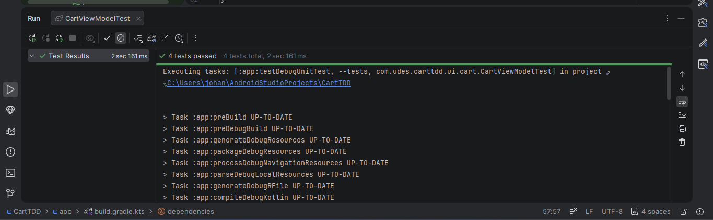
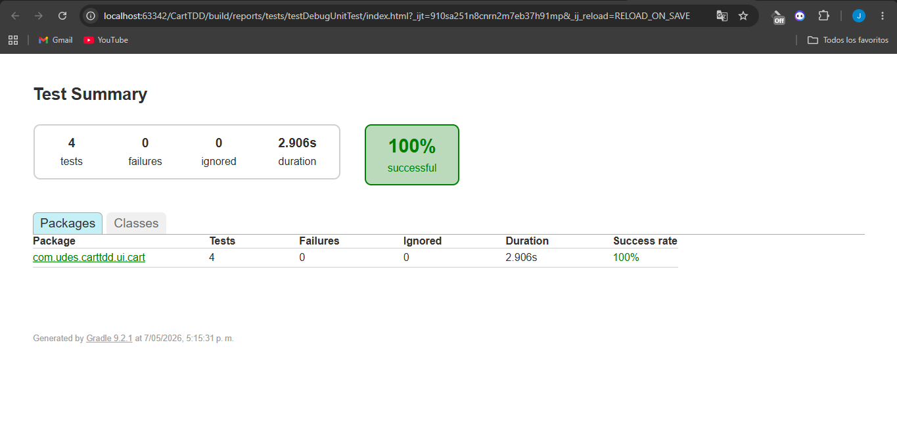
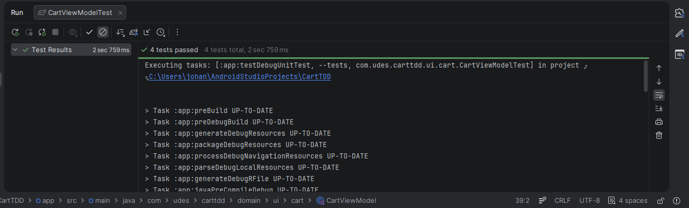

# Carreño-post1-u9
**Aplicaciones Móviles — Unidad 9: Testing y Aseguramiento de Calidad**  
Universidad de Santander (UDES) · Ingeniería de Sistemas · 2026

---

## Objetivo
Aplicar el ciclo Red-Green-Refactor de TDD para construir un `CartViewModel`
de Android testeado desde el primer commit, usando MockK para aislar dependencias.

---

## Ciclo TDD aplicado

### RED
Se escribieron los tests antes de que existiera `CartViewModel`.
Los tests compilaban pero fallaban con errores de referencia no resuelta,
confirmando que el código de producción no existía aún.

### GREEN
Se implementó `CartViewModel` con el código mínimo para hacer pasar los 4 tests.
Resultado: `4 tests completed, 0 failed`.

### REFACTOR
Se mejoró el código usando `runCatching`, se extrajo `calculateTotal()` como
función pura y se diferenció el mensaje de error para `IOException`.
Los 4 tests siguieron en verde.

---

## Tests implementados

| Test | Propósito |
|------|-----------|
| `loadCart emits Success state with items and total` | Verifica camino feliz: lista de items y total correcto (55.0) |
| `loadCart emits Error when repository throws` | Verifica que un IOException produce estado Error |
| `loadCart emits Loading before Success` | Verifica la secuencia Loading → Success |
| `calculateTotal returns 0 for empty list` | Verifica función pura con lista vacía |

---

## Salida de ./gradlew testDebugUnitTest
CartViewModelTest > loadCart emits Success state with items and total PASSED
CartViewModelTest > loadCart emits Error when repository throws PASSED
CartViewModelTest > loadCart emits Loading before Success PASSED
CartViewModelTest > calculateTotal returns 0 for empty list PASSED
4 tests completed, 0 failed

---

## Capturas

### GREEN — 4 tests en verde en la terminal

### GREEN - despues de los 4 test en verde en la interfaz

### REFACTOR — 100% exitoso tras refactorizar en la terminal

### REFACTOR — 100% exitoso tras refactorizar en la interfaz

---

## Estructura del proyecto
app/src/
├── main/java/com/udes/carttdd/
│   ├── domain/
│   │   ├── model/CartItem.kt
│   │   └── repository/CartRepository.kt, AnalyticsService.kt
│   └── ui/cart/
│       ├── CartUiState.kt
│       └── CartViewModel.kt
└── test/java/com/udes/carttdd/ui/cart/
└── CartViewModelTest.kt